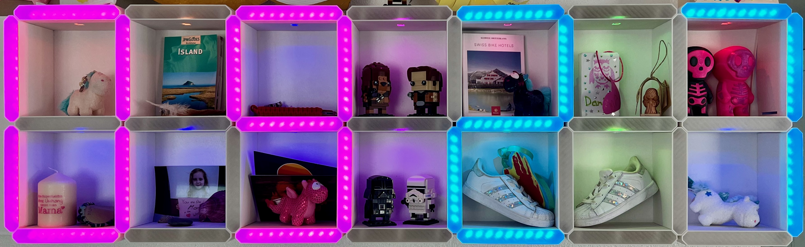
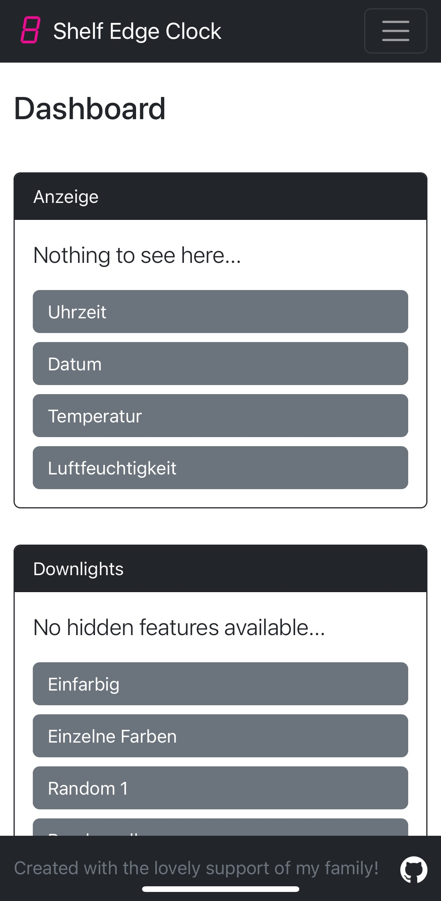
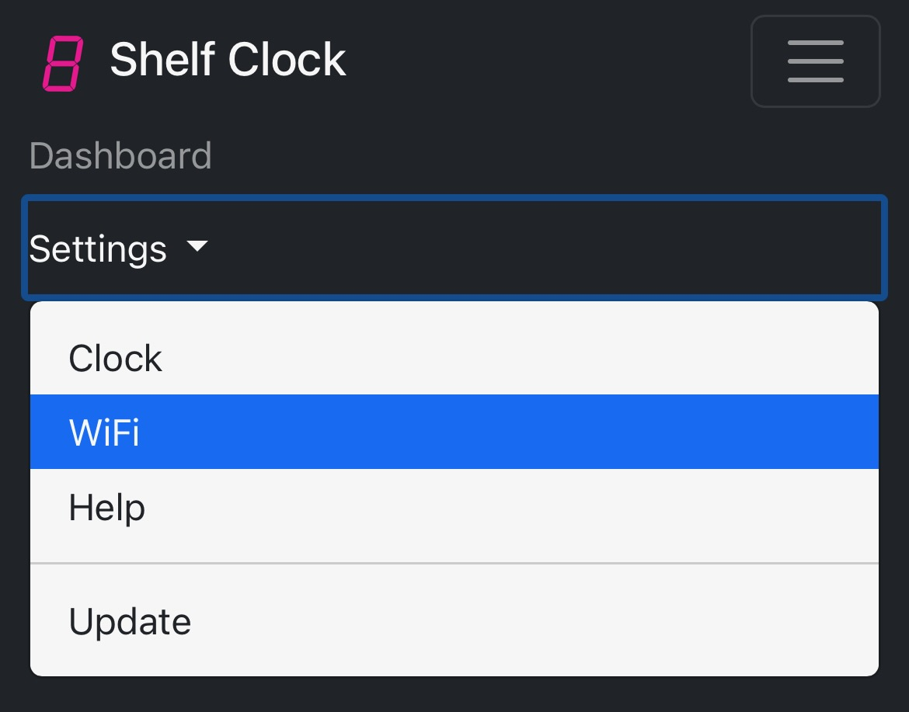
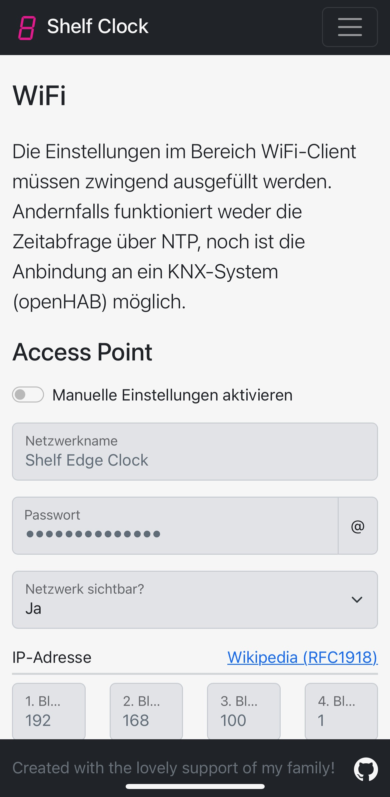

# Shelf Edge Clock powered by ESP32

   

The Shelf Edge Clock is heavily inspired by a post on social media showing the awesome project of [DIY-Machines](https://github.com/DIY-Machines/DigitalClockSmartShelving). After some consideration I decided to build the clock with the given 3D parts but adopt the software to an ESP32.

## Table of Contents

* [General Information](#general-information)
* [Features](#features)
* [Screenshots](#screenshots)
* [Setup](#setup)
  * [Hardware build](#hardware-build)
  * [Software installation](#software-installation)
  * [Configuration](#configuration)
    * [First time connection](#first-time-connection)
    * [Configure WiFi connection](#configure-wifi-connection)
    * [Future connection](#future-connection)
* [Usage](#usage)
  * [Mode - Clock](#mode---clock)
  * [Mode - Date](#mode---date)
  * [Mode - Temperature](#mode---temperature)
  * [Mode - Humidity](#mode---humidity)
  * [Mode - Scoreboard](#mode---scoreboard)
  * [Mode - Countdown](#mode---countdown)
  * [Mode - Scrolling](#mode---scrolling)
  * [Downlights](#downlights)
  * [there is more](#there-is-more)
* [Project Status](#project-status)
* [Room for Improvement](#room-for-improvement)
* [Technologies and Software](#technologies-and-software)
  * [Hardware](#hardware)
  * [Software](#software)
  * [Libraries](#libraries)
* [Acknowledgements](#acknowledgements)
* [Contact](#contact)
* [License](#license)

## General Information

The Shelf Edge Clock is powered by an ESP32 devkit and more than 250 neopixels. The clock itself is mostly 3D printed, some wood for a proper frame and minimal additional parts.

* folder `data` contains the files stored on the ESP32

## Features

* Powered by an ESP32 devkit out of the box.
* More than 250 neopixels across two strands.
* Webserver providing a GUI to control the clock.
* Webclient making requests to your home automation system (e.g. openHAB)

## Screenshots

## Setup

Setup instructions will be completed after all stuff is completed.

### Hardware build

1. Build a frame/background for your clock
2. Print all the required parts and screw them to the frame
3. Carefully wire all the electronics and power it up for the first time
4. Mount it to your prefered spot and enjoy the finished harware

### Software installation

1. Load the software to your ESP32
2. Get your self a drink and do nothing in the afternoon

### Configuration

#### First time connection

The shelf edge clock has its own wifi access point upon first launch and your're required to connect to it. Otherwise you won't make any changes to the settings.

* **SSID**: Shelf Edge Clock
* **Pass**: shelfEdgeClock

After connecting to the shelf edge clock, please open a web browser and enter the **ip address 192.168.100.1**. If successful, you'll see the following page:

#### Configure WiFi connection

Navigate to Einstellungen -> WiFi (see screenshot below for guidance)

Change the WiFi Client settings on this page. A working connection to your private network (getting data from your home automation system) and connection to the internet (setting the current time via NTP) is mandatory.

#### Future connection

As you've added the shelf edge clock to your home network, you can access the dashboard and settings by an internal ip address. You don't have to connect to the access point anymore.

## Usage

The shelf edge clock must be connected to your wifi network, otherwise it won't work. All functions rely on data acquired from the internet (e.g. NTP) or your local network (e.g. home automation/sensors)

### Mode - Clock

Displays the current time whichs is updated and verified by calling an external NTP server.

* preferred NTP server is configurable
* timezone can be set in settings [(find the correct value here)](https://github.com/nayarsystems/posix_tz_db/blob/master/zones.csv)
* two clock formats
  * 24 hours: 00:00 to 23:59 (default)
  * 12 hours: 12:00 to 11:59 AM/PM
* two color options: user defined colors or random colors
* both color options use two colors: one for hours and one for minutes

### Mode - Date

Displays the current date which is updated and verified by calling the external NTP server defined for the clock.

* two date formats
  * european style: 2903 -> march 29th (default)
  * american style: 0329 -> march 29th
* two color options: defined colors or random colors
* both color options use two colors: one for days and one for months

### Mode - Temperature

Displays the current outside temperature and regularly fetch the value from your home automation system or weather station.

* requires a home automation system (e.g. openHAB or similar with a rest api)
* settings provide a field to enter a string for the get call
* display type is fixed to XXYS
  * XX -> degree figure
  * Y -> decimal figure
  * S -> symbol
    * C -> abbreviation for celsius
    * F -> abbreviation for fahrenheit
* two color options: defined colors or random colors
* both color options use three colors: one for XX, one for Y and one for S

### Mode - Humidity

Display the current outside humidity and regularly fetch the value from your home automation system or weather station.

* requires a home automation system (e.g. openHAB or similar with a rest api)
* settings provide a field to enter a string for the get call
* display type is fixed to XXYH
  * XX -> percentage figure
  * Y -> decimal figure
  * H -> abbreviation for humidity
* two color options: defined colors or random colors
* both color options use three colors: one for XX, one for Y and one for H

### Mode - Scoreboard

Display a scoreboard for table soccer or whatever game you're playing that requires a scoreboard. You can also show the latest score of your favorite team.

* display type is fixed to HHAA: HH -> home team, AA -> away team
* one color option: user defined colors
* the color option uses two colors: one for HH and one for AA

### Mode - Countdown

Display a countdown and flash the word "EndE" at the end.

* display type is fixed
  * hhmm, if there is more than 60 minutes to countdown,
  * and switches to mmss, if the countdown is less than 60 minutes
* one color option: user defined colors
* the color option uses four colors: one for hours, one for minutes, one for seconds and one for the final 10 seconds

### Mode - Scrolling

Display certain values in a continuous loop and change every five seconds (customizable).

1. Clock
2. Date
3. Temperature

### Downlights

The 14 boxes created by the design of the clock are an ideal storage for small things. These items are highlighted by leds in the piece above.

* four color options
  * 1 user defined color
  * 14 user defined colors
  * 1 random color for all boxes
  * 14 random colors for each box

### there is more

* the brightness of the leds is either in auto mode, controlled by the brightness outside, or manual mode configured in the settings
* you may change the calculation/mapping of the led brightness yourself by setting the values for:
  * _home automation - min value_: value from outside that calls the lowest value for the leds
  * _home automation - max value_: value from outside that calls the highest value for the leds
  * _clock - min value_: the minimal brightness of the leds on the clock face
  * _clock - max value_: the maximal brightness of the leds on the clock face
  * _downlight - min value_: the minimal brightness of the downlight leds
  * _downlight - max value_: the maximal brightness of the downlight leds
* first connection to clock for configuration of the required wifi via access point generated by the ESP32 ([see configuration above](#configuration))
* the necessary data is stored in SPIFFS and therefore reducing the required parts
* integrated update mechanism for updates and bugfixes

## Project Status

Project is: **_in progress_**! Every new release was  on our our prototype running 24/7 and all known issues will be remediated before completion.

This README will receive continuous updates throughout the development. Please also check the [changelog](CHANGELOG.md) for more information.

## Room for Improvement

Planned improvements:

* add buzzer for the countdown (it's very quite at the moment)
* make GUI translation ready

## Technologies and Software

### Hardware

All hardware was bought from [Adafruit](https://www.adafruit.com) and all links below direct you to Adafruit's online shop. Adafruit doesn't provide an affiliate programm, therefore I won't benefit in any form plus I don't mind if you buy somewhere else.

* [ESP32-S3-DevKitC-1-N8](https://www.adafru.it/5312)
* [NeoPixel RGB LED Strip (60 led/m)](https://www.adafru.it/1138)
* [Switching Power Supply (5V 4000mA)](https://www.adafru.it/1466)
* [Wire Spool Set (22AWG stranded-core)](https://www.adafru.it/3175)
* [Buzzer](https://www.adafru.it/1536)

### Software

* Visual Studio Code (VSCode)
* PlatformIO - version 6.1.7
* Bootstrap - version 5.2.3
* jQuery - version 3.6.3

### Libraries

* Adafruit_NeoPixel Library by adafruit - version 1.11.0
* ArduinoHttpClient by Arduino - version 0.4.0
* AsyncElegantOTA by ayushsharma82 - version 2.2.7
* AsyncTCP by me-no-dev - version 1.1.1
* ESPAsyncWebServer by me-no-dev - version 1.2.3
* ESPmDNS by Hristo Gochkov - version 2.0.0
* NonBlockingRTTTL by Antoine Beauchamp - version 1.3.0
* Preferences by Hristo Gochkov - version 2.0.0
* SPIFFS by Hristo Gochkov - version 2.0.0
* WiFi by Hristo Gochkov - version 2.0.0

## Acknowledgements

* This project was inspired by the [Hidden Digital Clock Smart Shelving](https://github.com/DIY-Machines/DigitalClockSmartShelving) from [DIY-Machines](https://www.diymachines.co.uk).
* The code is created based on the excellent examples of [Random Nerd Tutorials](https://randomnerdtutorials.com).
* Many thanks to my family for the ongoing lovely support and encouragement, their creative ideas and wonderful help in creating this shelf edge clock.

## Contact

Created by [@CaptSnus](https://github.com/CaptSnus/) - feel free to contact me! Please report bugs, enhancements or feature request directly on [Github Issues](https://github.com/CaptSnus/ShelfEdgeClock/issues).

## License

This project is open source and available under the [MIT License](./LICENSE.md).
